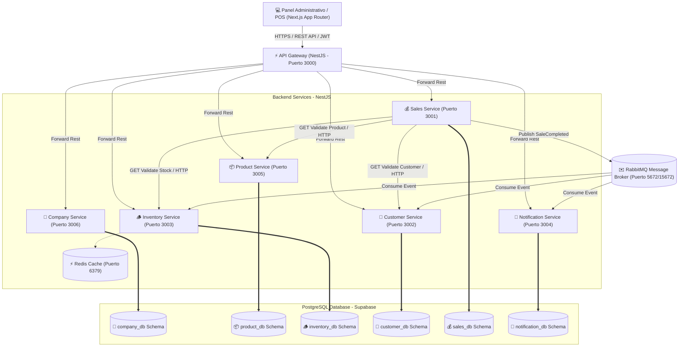

# 🛒 ERP SuperMarket Bolivia S.A. - Plataforma de Microservicios Distribuidos

Bienvenido al repositorio central de la plataforma distribuida para la cadena de supermercados **"OXXO Bolivia"** (Grupo 10). Este proyecto implementa una **Arquitectura de Microservicios orientada a eventos** (Event-Driven Architecture) gestionada en un monorepo, conectada a una base de datos PostgreSQL en Supabase y visualizada a través de un panel de control administrativo y punto de venta (POS) de nivel empresarial.

---

## 📐 1. Arquitectura General del Sistema

El sistema implementa una separación completa de responsabilidades tanto a nivel lógico como de almacenamiento:
- **Base de Datos Única pero Aislada**: Cada microservicio opera con su propio esquema lógico en Supabase (`company_db`, `customer_db`, `inventory_db`, `product_db`, `sales_db`, `notification_db`). Está prohibido realizar consultas directas (`JOINs` o queries directas) entre esquemas de diferentes servicios.
- **Comunicación Síncrona (REST)**: Utilizada exclusivamente para consultas de sólo lectura (`GET`) y validaciones de existencia cruzada.
- **Comunicación Asíncrona (RabbitMQ)**: Utilizada para la mutación de estados y efectos secundarios distribuídos. Por ejemplo, al finalizar una venta, el microservicio de Ventas emite un evento `SaleCompleted`, el cual es consumido asíncronamente por Inventario (para actualizar stocks), Clientes (para calcular y asignar puntos) y Notificaciones (para registrar el comprobante enviado).

### 📊 Diagrama de Arquitectura de Servicios



---

## 🔌 2. Mapa de Puertos y Servicios

| Componente | Directorio | Puerto Interno / Externo | Tecnología | Propósito |
| :--- | :--- | :--- | :--- | :--- |
| **RabbitMQ** | - | `5672` (AMQP), `15672` (Web Admin) | Erlang / Alpine | Broker de Mensajería y Eventos |
| **Redis** | - | `6379` | Redis / Alpine | Motor de Caché para Inventario |
| **ms-gateway** | `microservices/ms-gateway` | `3000` | NestJS | API Gateway unificado (Proxy) |
| **ms-sales** | `microservices/ms-sales` | `3001` | NestJS | Transacciones y Facturación |
| **ms-customer** | `microservices/ms-customer` | `3002` | NestJS | Programa de Puntos y Clientes |
| **ms-inventory** | `microservices/ms-inventory` | `3003` | NestJS | Kardex y Stock de Sucursales |
| **ms-notification** | `microservices/ms-notification` | `3004` | NestJS | Registro de Comprobantes |
| **ms-product** | `microservices/ms-product` | `3005` | NestJS | Catálogo y Barcodes de Productos |
| **ms-company** | `microservices/ms-company` | `3006` | NestJS | Sucursales, Ciudades y Compañías |
| **web-admin** | `apps/web-admin` | `4000` | Next.js 16 (React 19) | Panel Administrativo y POS (Tailwind) |

---

## 🚀 3. Preparación y Arranque Local

### Prerrequisitos
- **Node.js** (v18 o v20 recomendado)
- **Docker Desktop** (Activo y corriendo en segundo plano)

> [!IMPORTANT]
> **¿Problemas con Docker en tu máquina local?** Si no puedes iniciar Docker Desktop o tienes fallos en contenedores, revisa el archivo alternativo [READMEnoDocker.md](file:///Users/jafetquiroga/arquitectura_software/practica3/READMEnoDocker.md) para aprender a ejecutar la infraestructura con servicios gratuitos en la nube o instalaciones locales nativas sin depender de Docker.

### Paso 1. Instalar Dependencias del Espacio de Trabajo y Microservicios
Para descargar e instalar simultáneamente todas las dependencias en la raíz, en el frontend y en cada uno de los microservicios, ejecuta en la terminal de la raíz:
```bash
npm run install:all
```

### Paso 2. Configurar Variables de Entorno (`.env`)
Cada microservicio contiene un archivo `.env.example` en su respectivo directorio. Asegúrate de crear el archivo `.env` correspondiente en cada carpeta del microservicio:
1. Copia el archivo `.env.example` a `.env` en cada subcarpeta de `microservices/` y `apps/web-admin/`.
2. Asegúrate de configurar la cadena de conexión de Supabase PostgreSQL (`DATABASE_URL` y variables directas) y el secreto JWT (`JWT_SECRET` el cual por defecto es `default-jwt-secret-key-erp-supermarket` para desarrollo).

### Paso 3. Levantar Todo el Entorno con Un Solo Comando (Recomendado)
Para agilizar el inicio del entorno local de desarrollo, el comando unificado iniciará los contenedores de infraestructura, el Gateway, todos los microservicios y la interfaz de usuario:
```bash
npm run dev:all
```
*Este comando realiza internamente:*
1. Levanta los contenedores Docker para **RabbitMQ** y **Redis** en segundo plano (`npm run infra:up`).
2. Espera a que la infraestructura responda.
3. Ejecuta de forma paralela en la terminal todos los servicios y el frontend uniendo los logs por prefijos de colores.

---

## 🔒 4. Autenticación y Seguridad (JWT)

Todos los endpoints REST a nivel de microservicios están protegidos utilizando la estrategia de validación de tokens Bearer JWT (`JwtAuthGuard`). 
- **Secreto de Firma**: `default-jwt-secret-key-erp-supermarket` (configurable mediante `JWT_SECRET`).
- **Acceso Exclusivo en Frontend**: 
  - **URL de Login**: El panel del frontend implementa la protección de rutas redirigiendo a `/login` si no se encuentra un token activo en `localStorage`.
  - **Credenciales Oficiales de Demostración (QA)**:
    - **Correo**: `admin@supermarket.bo`
    - **Contraseña**: `admin123`
  - Al ingresar, el sistema firma / asigna el token oficial e intercepta todas las llamadas HTTP de Axios (`src/lib/axios.ts`) inyectando la cabecera `Authorization: Bearer <token>`.

---

## 🧪 5. Guía de Defensa QA (Checklist de 10 Pasos)

Sigue esta secuencia interactiva en la interfaz web (`http://localhost:4000`) para demostrar el flujo completo ante el tribunal:

### 🟩 Paso 1: Crear una Compañía
1. Ve al menú lateral **Administración** -> Pestaña **Compañías**.
2. Completa el formulario de registro ingresando el nombre **"OXXO Bolivia"**.
3. Haz clic en **Registrar Compañía** y confirma su aparición en la lista.

### 🟩 Paso 2: Crear Sucursales
1. Ve a **Administración** -> Pestaña **Sucursales**.
2. Registra la primera sucursal:
   - **Nombre**: `Sucursal Prado`
   - **Dirección**: `Av. 16 de Julio (El Prado), La Paz`
   - Mapea a la compañía **"OXXO Bolivia"** y a una ciudad de la lista.
3. Registra la segunda sucursal:
   - **Nombre**: `Sucursal El Alto`
   - **Dirección**: `Av. Satélite, El Alto`
   - Mapea a la misma compañía **"OXXO Bolivia"**.

### 🟩 Paso 3: Registrar Productos
1. Ve a **Administración** -> Pestaña **Productos**.
2. Registra un nuevo producto (ej. **"Producto X"** o **"Leche Pil 980cc"**):
   - Asigna un nombre, categoría, código de barras (barcode) y un precio base (ej. `Bs 18.50`).
3. Confirma la creación del producto.

### 🟩 Paso 4: Cargar / Importar Inventario Inicial
1. Ve a **Inventario y Kardex** -> Haz clic en **Ingresar Lote / Carga Inicial** o **Cargar Inventario (Excel)**.
2. Selecciona la sucursal **"Sucursal Prado"**, busca el producto recién creado, ingresa una cantidad (ej. **100 unidades**) y el precio de costo.
3. Envía el formulario para registrar el movimiento de entrada en el Kardex.

### 🟩 Paso 5: Consultar Existencias
1. Permanece en el módulo **Inventario y Kardex**.
2. Observa la cuadrícula de tarjetas consolidadas de **Existencias Nacionales**.
3. Confirma que el producto muestra un total consolidado de **100 unidades** a nivel nacional.

### 🟩 Paso 6: Registrar un Cliente
1. Ve al módulo **Administración** -> Pestaña **Clientes**.
2. Registra los datos del cliente de demostración:
   - **Nombre**: `Juanito Pérez`
   - **C.I.**: `1234567 LP` (Debe ser único)
   - Completa su teléfono y correo electrónico.
3. Confirma que el cliente se ha registrado con un saldo inicial de **0 puntos**.

### 🟩 Paso 7: Realizar una Venta (POS)
1. Ve al menú **Punto de Venta (POS)**.
2. Sigue el flujo estricto:
   - **Selecciona la Sucursal**: `Sucursal Prado`. *(El POS se habilitará al seleccionar una sucursal)*.
   - **Selecciona el Cliente**: `Juanito Pérez`.
3. Busca el producto en el catálogo lateral e incorpóralo al carrito (ej. **2 unidades**).
4. El POS mostrará el desglose financiero del subtotal e IVA.
5. Selecciona el método de pago (Efectivo o Tarjeta) y presiona **Procesar Venta**.
6. Observa el modal animado con el comprobante de venta emitido con éxito.
7. **Efectos Secundarios Verificados (RabbitMQ)**:
   - Ve a **Inventario** y consulta el Kardex de la *Sucursal Prado*: Verás el descuento de **2 unidades**.
   - Ve a **Administración** -> **Clientes**: Verás que *Juanito Pérez* ahora acumuló puntos de fidelización de forma dinámica.
   - Ve a **Reportes Diarios**: La venta se sumará a los ingresos financieros del día.

### 🟩 Paso 8: Registrar una Baja de Inventario
1. Ve al módulo **Administración** -> Pestaña **Registrar Baja / Pérdida**.
2. Completa los datos:
   - **Sucursal**: `Sucursal Prado`
   - **Producto**: Selecciona tu producto.
   - **Cantidad a dar de baja**: Ingresa una cantidad (ej. `5`).
   - **Motivo**: `Producto Vencido` o `Daño Físico`.
3. Envía el registro y verifica que el stock del producto disminuye a **93 unidades** (100 iniciales - 2 vendidas - 5 de baja).

### 🟩 Paso 9: Transferir Stock entre Sucursales
1. Ve al módulo **Inventario y Kardex** -> Haz clic en **Transferir Inventario**.
2. Llena el formulario:
   - **Sucursal de Origen**: `Sucursal Prado` (Stock disponible: 93)
   - **Sucursal de Destino**: `Sucursal El Alto`
   - **Producto**: Selecciona el mismo producto.
   - **Cantidad**: `50`
3. Presiona **Confirmar Transferencia**.
4. El sistema restará el inventario en la Sucursal de Origen y sumará asíncronamente las 50 unidades en la Sucursal de Destino.

### 🟩 Paso 10: Consultar Saldos Finales de Inventario y Kardex
1. Ve a **Inventario y Kardex**.
2. En la lista desplegable de sucursales:
   - Selecciona **Sucursal Prado**: Verás el Kardex detallando la carga inicial (+100), la venta (-2), la baja (-5) y la transferencia de salida (-50), dejando un saldo de **43 unidades**.
   - Selecciona **Sucursal El Alto**: Verás el Kardex detallando la transferencia de entrada (+50), con un saldo de **50 unidades**.
3. Confirma en las tarjetas de stock nacional que el total de existencias se mantiene íntegro en **93 unidades** distribuidas en el país.

---

## 📜 6. Reglas de Contribución para Desarrolladores
- **Database Isolation**: Nunca utilices comandos SQL que crucen esquemas en consultas directas.
- **Microservices State Mutations**: Toda mutación en otro servicio debe ser gatillada asíncronamente publicando eventos en RabbitMQ.
- **Git Feature Branching**: Crea ramas siguiendo el formato `feat/nombre-feature` o `fix/nombre-bug`. No mezcles dependencias individuales de desarrollo.